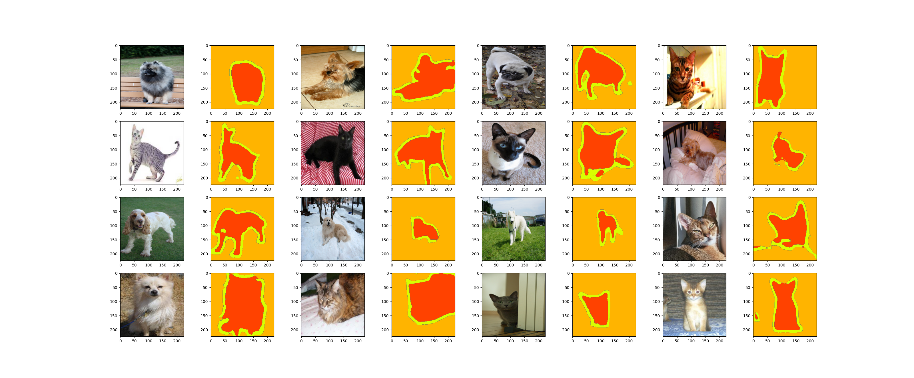

# Oxford III-T Pets Segmentation



## Score Table

Below table depicts performance of selected Deep Learning models employed to solve Semantic Segmentation problem
on _Oxford III-T Pets Segmentation_. All models were trained with few popular loss functions. 

| __Loss Function__  | __DeepLabV3__ | __FCN-VGG-32s__ | __FCN-VGG-16s__ | __FCN-VGG-8s__ | __SegNet__ | __U-Net_ |
|--------------------|---------------|-----------------|-----------------|----------------|------------|----------|
| Cross-entropy Loss | 0.8874        | 0.8453          | 0.8833          | 0.8237         | 0.8736     | 0.8341   |
| Dice Loss          | 0.8581        | 0.8888          | __0.9096__      | 0.8213         | 0.8904     | 0.8108   |
| BCE Loss           | 0.7714        | 0.8254          | 0.8712          | 0.8274         | 0.5380     | 0.7510   |
| Dice BCE Loss      | 0.6639        | 0.7983          | 0.8486          | 0.8091         | 0.8782     | 0.2849   |
| Focal Loss         | 0.0632        | 0.8269          | 0.8455          | 0.5308         | 0.0292     | 0.1177   |
| Tversky Loss       | 0.8539        | 0.8454          | 0.9035          | 0.8589         | 0.8453     | 0.8101   |
| Focal Tversky Loss | 0.8534        | 0.8353          | 0.9044          | 0.5838         | 0.8312     | 0.5839   |

## Try it yourself

### Dependencies  

- [Python 3.X](https://www.python.org/downloads/)
- [git](https://git-scm.com/downloads)

#### Clone repository

```shell
git clone https://github.com/karolcymerys/oxford-iiit-pets-segmentation.git
```

#### Install Python dependencies

```shell
pip install -r requirements.txt
```

## References

[[1] The Oxford-IIIT Pet Dataset](https://www.robots.ox.ac.uk/~vgg/data/pets/)  
[[2] Efficient Image Segmentation Using PyTorch](https://towardsdatascience.com/efficient-image-segmentation-using-pytorch-part-1-89e8297a0923)  
[[3] Loss Function Library - Keras & PyTorch](https://www.kaggle.com/code/bigironsphere/loss-function-library-keras-pytorch)  
