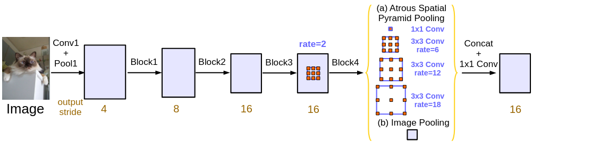

# Deep Lab V3
___

_Deep Lab_ is a family of Deep Convolutional Neural Networks designed to solved Semantic Segmentation problem.
It employs backbone network (e.g. _VGG_, _ResNet_, _Xception_). Usually, they are modified by using _atrous convolution_.
Such technique allows to extract from signal more global relationships than typical _convolution_ with the same computational resources.
Extracted by _backbone network_ features are processed by _Atrous Spatial Pyramid Pooling_ (ASPP). 
This technique allows to improve performance by extracting signal with different scales (_atrous rates_).
Finally, signal is classified and enlarged using linear interpolation.

Below picture depicts the original architecture of _DeeplabV3_:

## Experiments

## References
___
[[1] Liang-Chieh Chen, George Papandreou, Iasonas Kokkinos, Kevin Murphy, Alan L. Yuille _DeepLab: Semantic Image Segmentation with Deep Convolutional Nets, Atrous Convolution, and Fully Connected CRFs_](https://arxiv.org/abs/1606.00915)  
[[2] Liang-Chieh Chen, George Papandreou, Florian Schroff, Hartwig Adam _Rethinking Atrous Convolution for Semantic Image Segmentation_](https://arxiv.org/abs/1706.05587)  
[[3] Liang-Chieh Chen, Yukun Zhu, George Papandreou, Florian Schroff, Hartwig Adam _Encoder-Decoder with Atrous Separable Convolution for Semantic Image Segmentation_](https://arxiv.org/abs/1802.02611v3)  
[[4] Witnessing the Progression in Semantic Segmentation: DeepLab Series from V1 to V3+](https://towardsdatascience.com/witnessing-the-progression-in-semantic-segmentation-deeplab-series-from-v1-to-v3-4f1dd0899e6e)  

