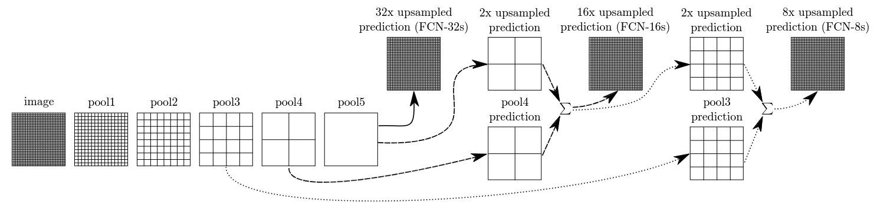

# Fully Convolutional Network
___

_Fully Convolutional Network_ (FCN) is next example of CNN utilized for Semantic Segmentation purposes.
It employs _VGG-16_ layers to extract essential characteristics of provided input signal. 
Next, encoded input signal is enlarged with _deconvolution_ technique (by using `ConvTranspose2d`).
Finally, response is cropped to achieve the same size as the input image.

Below picture depicts the original architecture of FCN:

## Experiments

In order to compare performance of above implementations. There was utilized __Oxford III-T Pets__.
As a metric mean Intersection over Union (mIOU) was utilized. Models are compared on validation sets:

| __Loss Function__  | __FCN-VGG-32s__ | __FCN-VGG-16s__ | __FCN-VGG-8s__ |
|--------------------|-----------------|-----------------|----------------| 
| Cross-entropy Loss | 0.8453          | 0.8833          | 0.8237         | 
| Dice Loss          | 0.8888          | 0.9096          | 0.8213         |
| BCE Loss           | 0.8254          | 0.8712          | 0.8274         |
| Dice BCE Loss      | 0.7983          | 0.8486          | 0.8091         |
| Focal Loss         | 0.8269          | 0.8455          | 0.5308         |
| Tversky Loss       | 0.8454          | 0.9035          | 0.8589         |
| Focal Tversky Loss | 0.8353          | 0.9044          | 0.5838         |

## References
___
[[1] Jonathan Long, Evan Shelhamer, Trevor Darrell _Fully Convolutional Networks for Semantic Segmentation_](https://arxiv.org/pdf/1411.4038)  
[[2] pytorch-fcn](https://github.com/wkentaro/pytorch-fcn/tree/main)
