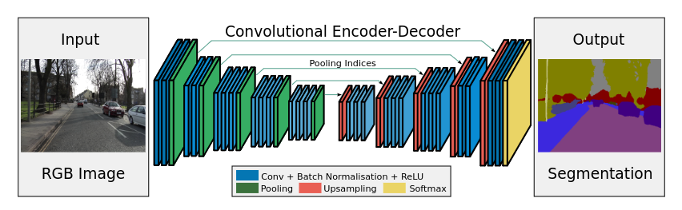

# SegNet
___

_SegNet_ is an example of CNN with encoder-decoder architecture. 
The encoder part is identical to 13 convolutional layers in the VGG16 network. 
The only difference is presence of _Batch Normalization_ layers between each _Conv_ Layer and _ReLU_ layer.
The goal of decoder part is to decode encoded representation of input to final response - 
classification of input image pixels to pre-defined labels. 
Its architecture is reversed compared to the encoder. 
The only difference is that _Pooling_ layers are replaced by _Upsampling_ layers and 
moved at the beginning of the blocks. Additionally, indices from _Pooling_ layers are 
forwarded to corresponding _Upsampling_ layers.

Below picture depicts the original architecture of SegNet:

## Implementations
___
### SegNet v1
The first implementation is reflection of original _SegNet_ definition from the paper. 
In order to initialize layers of the encoder, weights of pretrained _VGG16_ model were utilized.

### SegNet v2
In the second implementation:  
- _Upsampling_ layers were replaced by _ConvTranspose_ layers  
- indices from _Pooling_ layers are not forwarded to corresponding _ConvTranspose_ layers
- to the input of decoder blocks, there was added signal from corresponding encoder blocks  

In order to initialize layers of the encoder, weights of pretrained _VGG16_ model were utilized.

### SegNet v3
Compared to _SegNet v2_, in the third implementation:
- the input of decoder blocks was concatenated with signal from corresponding encoder blocks  
- size of decoder block channels were modified  

In order to initialize layers of the encoder, weights of pretrained _VGG16_ model were utilized.

## Experiments

In order to compare performance of above implementations. There was utilized __People Clothing Segmentation Dataset__.
As a metric mean Intersection over Union (mIOU) was utilized. Models are compared on validation sets:

| __Loss Function__  | __SegNet V1__ | __SegNet V2__ | __SegNet V3__ |
|--------------------|---------------|---------------|---------------| 
| Cross-entropy Loss | N/A           | N/A           | N/A           | 
| Dice Loss          | 0.0879        | 0.1166        | 0.1066        |

## References
___
[[1] Vijay Badrinarayanan, Alex Kendall, Roberto Cipolla _SegNet: A Deep Convolutional Encoder-Decoder Architecture for Image Segmentation_](https://arxiv.org/abs/1511.00561)  
[[2] Pytorch SegNet & DeepLabV3 Training](https://www.kaggle.com/code/robinreni/pytorch-segnet-deeplabv3-training)
