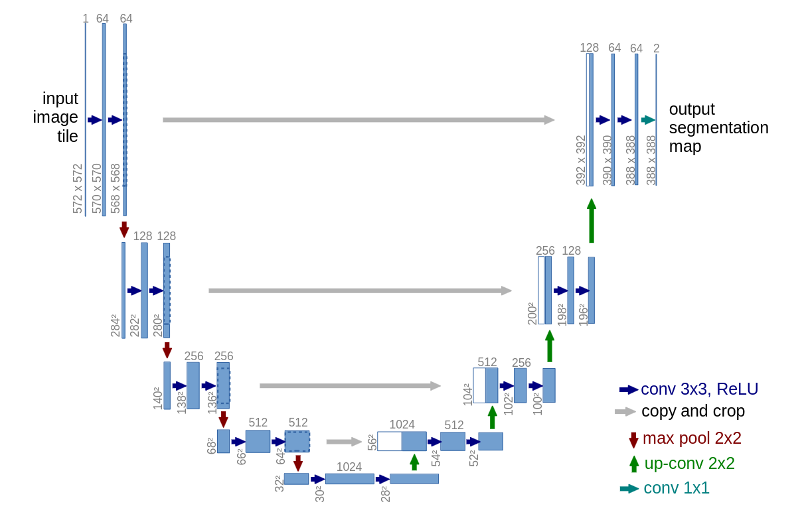

# U-Net
___

_U-Net_ is another example of CNN with encoder-decoder architecture.
As a backbone network there are utilized layers of __VGG-16__ network, called _contracting blocks_.
Encoded input signal is next processed by _expansive blocks_. 
Their goal is to enlarge signal produced by encoder layers.
Additionally, signal from corresponding _contracting blocks_ is concatenated and passed as input to _expansive blocks_.
In order to achieve the matrices with the same size, signals from _contracting blocks_ are cropped.  

Below picture depicts the original architecture of U-Net:

## Implementations
___
### U-Net v1
The first implementation is reflection of original _U-Net_ definition from the original paper. 
The only difference are Batch Normalization layers. 
As output of _U-Net_ v1 is not the same as provided input image, this network was not evaluated in experiments.

### U-Net v2
In second implementation padding of convolutional layers was increased to 1. 
Thanks to that, output signal contains tensor with the same size as provided input image.

## Experiments

In order to compare performance of above implementations. There was utilized __Oxford III-T Pets__.
As a metric mean Intersection over Union (mIOU) was utilized. Models are compared on validation sets:

| __Loss Function__  | __U-Net__ |
|--------------------|-----------|
| Cross-entropy Loss | 0.8341    |
| Dice Loss          | 0.8108    |

## References
___
[[1] Olaf Ronneberger, Philipp Fischer, Thomas Brox _U-Net: Convolutional Networks for Biomedical Image Segmentation_](https://arxiv.org/abs/1505.04597)  
[[2] Pytorch-UNet](https://github.com/milesial/Pytorch-UNet/blob/master/unet/unet_parts.py)  
[[3] UNet for Building Segmentation (PyTorch)](https://www.kaggle.com/code/balraj98/unet-for-building-segmentation-pytorch#Training-UNet)